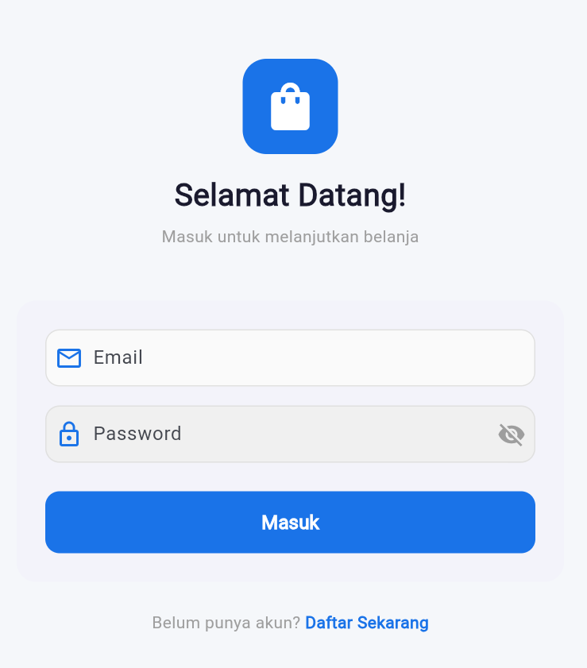
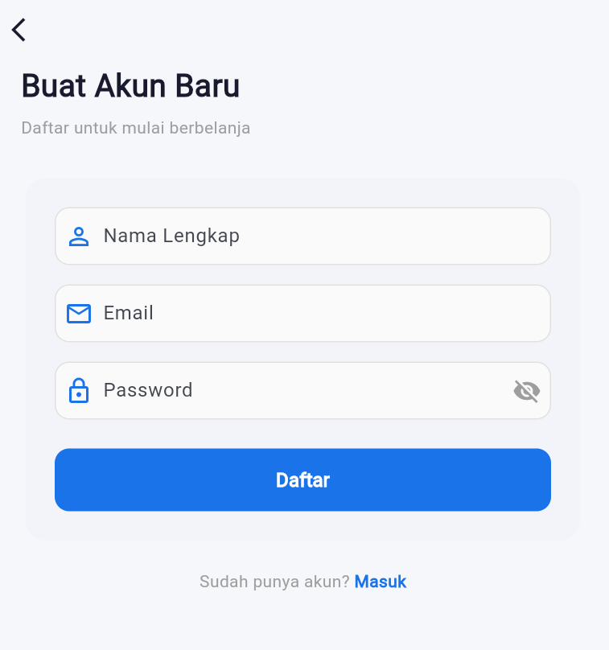
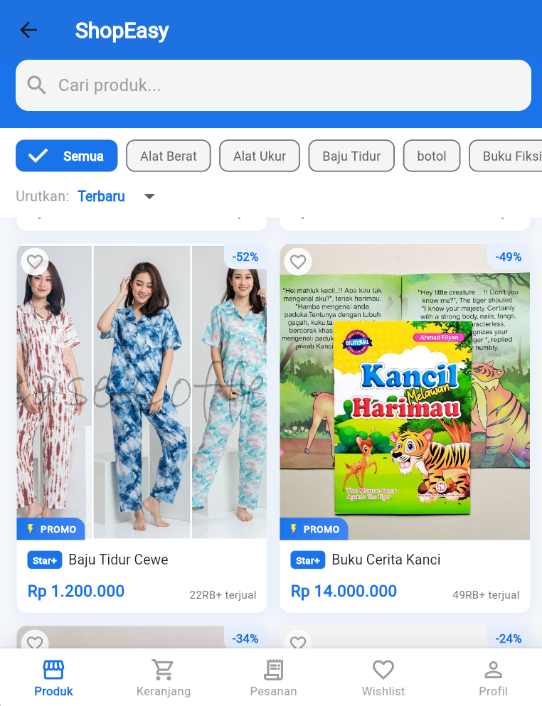
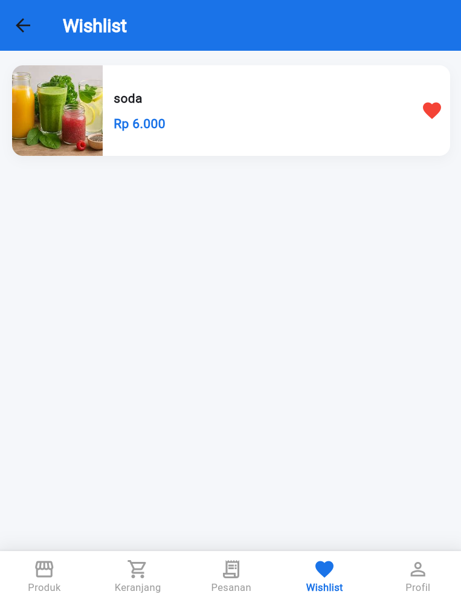

# UAS Praktikum Mobile - ShopEasy

## Data Mahasiswa
- **Nama**: Raja Naufal Fadhil
- **NIM**: 2306020
- **Kelas**: A-Informatika

## Daftar Fitur yang Diimplementasikan
- **Autentikasi**: Fitur Login dan Register akun pengguna.
- **Katalog Produk**: Menampilkan daftar produk dengan fitur pencarian (search), pengurutan, dan filter berdasarkan kategori.
- **Detail Produk**: Menampilkan informasi spesifik produk, sisa stok, dan pengaturan jumlah barang yang ingin ditambahkan.
- **Keranjang Belanja (Cart)**: Menambahkan produk ke keranjang belanja dengan integrasi *bottom navigation bar*.
- **Wishlist**: Menambahkan produk ke daftar favorit (Wishlist) dengan menekan icon hati pada katalog maupun detail produk.
- **State Management**: Menggunakan `Provider` untuk mengelola *state* keranjang, wishlist, produk, dan autentikasi.

## Cara Menjalankan Aplikasi

1. Pastikan Anda sudah menginstal Flutter SDK di komputer Anda.
2. Clone repositori ini:
   ```bash
   git clone https://github.com/RajaNaufal011/UAS_PRAK-MOBILE.git
   ```
3. Masuk ke direktori proyek:
   ```bash
   cd UAS_PRAK-MOBILE
   ```
4. Unduh semua dependensi paket:
   ```bash
   flutter pub get
   ```
5. Jalankan aplikasi (bisa melalui emulator atau device asli):
   ```bash
   flutter run
   ```

## Screenshot Aplikasi

Berikut adalah tampilan dari aplikasi ShopEasy:

### 1. Halaman Login


### 2. Halaman Register


### 3. Halaman Daftar Produk (Home)


### 4. Halaman Detail Produk


### 5. Halaman Wishlist

